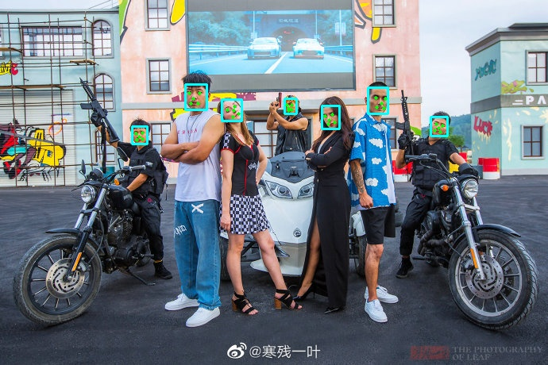

# scrfd.lite.ai.toolkit
使用 🍅🍅 Lite.AI.ToolKit C++工具箱来跑SCRFD的一些案例(https://github.com/DefTruth/lite.ai.toolkit) , 包含ONNXRuntime C++、MNN、TNN和NCNN版本。


Star⭐️🌟什么的，就随缘吧~ 🙃🤪🍀

## 2. C++版本源码

SCRFD C++ 版本的源码包含ONNXRuntime、MNN、TNN和NCNN四个版本，源码可以在 [lite.ai.toolkit](https://github.com/DefTruth/lite.ai.toolkit) 工具箱中找到。本项目主要介绍如何基于 [lite.ai.toolkit](https://github.com/DefTruth/lite.ai.toolkit) 工具箱，直接使用SCRFD来跑人脸检测。需要说明的是，本项目是基于MacOS下编译的 [liblite.ai.toolkit.v0.1.0.dylib](https://github.com/DefTruth/yolox.lite.ai.toolkit/blob/main/lite.ai.toolkit/lib) 来实现的，对于使用MacOS的用户，可以直接下载本项目包含的*liblite.ai.toolkit.v0.1.0*动态库和其他依赖库进行使用。而非MacOS用户，则需要从[lite.ai.toolkit](https://github.com/DefTruth/lite.ai.toolkit) 中下载源码进行编译。[lite.ai.toolkit](https://github.com/DefTruth/lite.ai.toolkit) c++工具箱目前包含70+流行的开源模型，就不多介绍了，只是平时顺手捏的，整合了自己学习过程中接触到的一些模型，感兴趣的同学可以去看看。
* [scrfd.cpp](https://github.com/DefTruth/lite.ai.toolkit/blob/main/lite/ort/cv/scrfd.cpp)
* [scrfd.h](https://github.com/DefTruth/lite.ai.toolkit/blob/main/lite/ort/cv/scrfd.h)
* [mnn_scrfd.cpp](https://github.com/DefTruth/lite.ai.toolkit/blob/main/lite/mnn/cv/mnn_scrfd.cpp)
* [mnn_scrfd.h](https://github.com/DefTruth/lite.ai.toolkit/blob/main/lite/mnn/cv/mnn_scrfd.h)
* [tnn_scrfd.cpp](https://github.com/DefTruth/lite.ai.toolkit/blob/main/lite/tnn/cv/tnn_scrfd.cpp)
* [tnn_scrfd.h](https://github.com/DefTruth/lite.ai.toolkit/blob/main/lite/tnn/cv/tnn_scrfd.h)
* [ncnn_scrfd.cpp](https://github.com/DefTruth/lite.ai.toolkit/blob/main/lite/ncnn/cv/ncnn_scrfd.cpp)
* [ncnn_scrfd.h](https://github.com/DefTruth/lite.ai.toolkit/blob/main/lite/ncnn/cv/ncnn_scrfd.h)  

ONNXRuntime C++、MNN、TNN和NCNN版本的推理实现均已测试通过，欢迎白嫖~  


## 3. 模型文件

### 3.1 ONNX模型文件
可以从我提供的链接下载 ([Baidu Drive](https://pan.baidu.com/s/1elUGcx7CZkkjEoYhTMwTRQ) code: 8gin) , 也可以从本直接仓库下载。


|                 Class                 |      Pretrained ONNX Files      |              Rename or Converted From (Repo)              | Size  |
| :-----------------------------------: | :-----------------------------: | :-------------------------------------------------------: | :---: |  
| *lite::cv::face::detect::SCRFD* | scrfd_500m_shape160x160.onnx | [SCRFD](https://github.com/deepinsight/insightface/blob/master/detection/scrfd)  | 2.5Mb |
| *lite::cv::face::detect::SCRFD* | scrfd_500m_shape320x320.onnx | [SCRFD](https://github.com/deepinsight/insightface/blob/master/detection/scrfd)  | 2.5Mb |
| *lite::cv::face::detect::SCRFD* | scrfd_500m_shape640x640.onnx | [SCRFD](https://github.com/deepinsight/insightface/blob/master/detection/scrfd)  | 2.5Mb |
| *lite::cv::face::detect::SCRFD* | scrfd_500m_bnkps_shape160x160.onnx | [SCRFD](https://github.com/deepinsight/insightface/blob/master/detection/scrfd)  | 2.5Mb |  
| *lite::cv::face::detect::SCRFD* | scrfd_500m_bnkps_shape320x320.onnx | [SCRFD](https://github.com/deepinsight/insightface/blob/master/detection/scrfd)  | 2.5Mb |  
| *lite::cv::face::detect::SCRFD* | scrfd_500m_bnkps_shape640x640.onnx | [SCRFD](https://github.com/deepinsight/insightface/blob/master/detection/scrfd)  | 2.5Mb |  
| *lite::cv::face::detect::SCRFD* | scrfd_1g_shape160x160.onnx | [SCRFD](https://github.com/deepinsight/insightface/blob/master/detection/scrfd)  | 2.7Mb |
| *lite::cv::face::detect::SCRFD* | scrfd_1g_shape320x320.onnx | [SCRFD](https://github.com/deepinsight/insightface/blob/master/detection/scrfd)  | 2.7Mb |
| *lite::cv::face::detect::SCRFD* | scrfd_1g_shape640x640.onnx | [SCRFD](https://github.com/deepinsight/insightface/blob/master/detection/scrfd)  | 2.7Mb |
| *lite::cv::face::detect::SCRFD* | scrfd_2.5g_shape160x160.onnx | [SCRFD](https://github.com/deepinsight/insightface/blob/master/detection/scrfd)  | 3.3Mb |
| *lite::cv::face::detect::SCRFD* | scrfd_2.5g_shape320x320.onnx | [SCRFD](https://github.com/deepinsight/insightface/blob/master/detection/scrfd)  | 3.3Mb |
| *lite::cv::face::detect::SCRFD* | scrfd_2.5g_shape640x640.onnx | [SCRFD](https://github.com/deepinsight/insightface/blob/master/detection/scrfd)  | 3.3Mb |
| *lite::cv::face::detect::SCRFD* | scrfd_2.5g_bnkps_shape160x160.onnx | [SCRFD](https://github.com/deepinsight/insightface/blob/master/detection/scrfd)  | 3.3Mb |  
| *lite::cv::face::detect::SCRFD* | scrfd_2.5g_bnkps_shape320x320.onnx | [SCRFD](https://github.com/deepinsight/insightface/blob/master/detection/scrfd)  | 3.3Mb |  
| *lite::cv::face::detect::SCRFD* | scrfd_2.5g_bnkps_shape640x640.onnx | [SCRFD](https://github.com/deepinsight/insightface/blob/master/detection/scrfd)  | 3.3Mb |  
| *lite::cv::face::detect::SCRFD* | scrfd_10g_shape640x640.onnx | [SCRFD](https://github.com/deepinsight/insightface/blob/master/detection/scrfd)  | 16.9Mb |
| *lite::cv::face::detect::SCRFD* | scrfd_10g_shape1280x1280.onnx | [SCRFD](https://github.com/deepinsight/insightface/blob/master/detection/scrfd)  | 16.9Mb |
| *lite::cv::face::detect::SCRFD* | scrfd_10g_bnkps_shape640x640.onnx | [SCRFD](https://github.com/deepinsight/insightface/blob/master/detection/scrfd)  | 16.9Mb |  
| *lite::cv::face::detect::SCRFD* | scrfd_10g_bnkps_shape1280x1280.onnx | [SCRFD](https://github.com/deepinsight/insightface/blob/master/detection/scrfd)  | 16.9Mb |  


### 3.2 MNN模型文件
MNN模型文件下载地址，([Baidu Drive](https://pan.baidu.com/s/1KyO-bCYUv6qPq2M8BH_Okg) code: 9v63), 也可以从本直接仓库下载。

|                 Class                 |      Pretrained MNN Files      |              Rename or Converted From (Repo)              | Size  |
| :-----------------------------------: | :-----------------------------: | :-------------------------------------------------------: | :---: |
| *lite::mnn::cv::face::detect::SCRFD* | scrfd_500m_shape160x160.mnn | [SCRFD](https://github.com/deepinsight/insightface/blob/master/detection/scrfd)  | 2.5Mb |
| *lite::mnn::cv::face::detect::SCRFD* | scrfd_500m_shape320x320.mnn | [SCRFD](https://github.com/deepinsight/insightface/blob/master/detection/scrfd)  | 2.5Mb |
| *lite::mnn::cv::face::detect::SCRFD* | scrfd_500m_shape640x640.mnn | [SCRFD](https://github.com/deepinsight/insightface/blob/master/detection/scrfd)  | 2.5Mb |
| *lite::mnn::cv::face::detect::SCRFD* | scrfd_500m_bnkps_shape160x160.mnn | [SCRFD](https://github.com/deepinsight/insightface/blob/master/detection/scrfd)  | 2.5Mb |  
| *lite::mnn::cv::face::detect::SCRFD* | scrfd_500m_bnkps_shape320x320.mnn | [SCRFD](https://github.com/deepinsight/insightface/blob/master/detection/scrfd)  | 2.5Mb |  
| *lite::mnn::cv::face::detect::SCRFD* | scrfd_500m_bnkps_shape640x640.mnn | [SCRFD](https://github.com/deepinsight/insightface/blob/master/detection/scrfd)  | 2.5Mb |  
| *lite::mnn::cv::face::detect::SCRFD* | scrfd_1g_shape160x160.mnn | [SCRFD](https://github.com/deepinsight/insightface/blob/master/detection/scrfd)  | 2.7Mb |
| *lite::mnn::cv::face::detect::SCRFD* | scrfd_1g_shape320x320.mnn | [SCRFD](https://github.com/deepinsight/insightface/blob/master/detection/scrfd)  | 2.7Mb |
| *lite::mnn::cv::face::detect::SCRFD* | scrfd_1g_shape640x640.mnn | [SCRFD](https://github.com/deepinsight/insightface/blob/master/detection/scrfd)  | 2.7Mb |
| *lite::mnn::cv::face::detect::SCRFD* | scrfd_2.5g_shape160x160.mnn | [SCRFD](https://github.com/deepinsight/insightface/blob/master/detection/scrfd)  | 3.3Mb |
| *lite::mnn::cv::face::detect::SCRFD* | scrfd_2.5g_shape320x320.mnn | [SCRFD](https://github.com/deepinsight/insightface/blob/master/detection/scrfd)  | 3.3Mb |
| *lite::mnn::cv::face::detect::SCRFD* | scrfd_2.5g_shape640x640.mnn | [SCRFD](https://github.com/deepinsight/insightface/blob/master/detection/scrfd)  | 3.3Mb |
| *lite::mnn::cv::face::detect::SCRFD* | scrfd_2.5g_bnkps_shape160x160.mnn | [SCRFD](https://github.com/deepinsight/insightface/blob/master/detection/scrfd)  | 3.3Mb |  
| *lite::mnn::cv::face::detect::SCRFD* | scrfd_2.5g_bnkps_shape320x320.mnn | [SCRFD](https://github.com/deepinsight/insightface/blob/master/detection/scrfd)  | 3.3Mb |  
| *lite::mnn::cv::face::detect::SCRFD* | scrfd_2.5g_bnkps_shape640x640.mnn | [SCRFD](https://github.com/deepinsight/insightface/blob/master/detection/scrfd)  | 3.3Mb |  
| *lite::mnn::cv::face::detect::SCRFD* | scrfd_10g_shape640x640.mnn | [SCRFD](https://github.com/deepinsight/insightface/blob/master/detection/scrfd)  | 16.9Mb |
| *lite::mnn::cv::face::detect::SCRFD* | scrfd_10g_shape1280x1280.mnn | [SCRFD](https://github.com/deepinsight/insightface/blob/master/detection/scrfd)  | 16.9Mb |
| *lite::mnn::cv::face::detect::SCRFD* | scrfd_10g_bnkps_shape640x640.mnn | [SCRFD](https://github.com/deepinsight/insightface/blob/master/detection/scrfd)  | 16.9Mb |  
| *lite::mnn::cv::face::detect::SCRFD* | scrfd_10g_bnkps_shape1280x1280.mnn | [SCRFD](https://github.com/deepinsight/insightface/blob/master/detection/scrfd)  | 16.9Mb |  


### 3.3 TNN模型文件
TNN模型文件下载地址，([Baidu Drive](https://pan.baidu.com/s/1lvM2YKyUbEc5HKVtqITpcw) code: 6o6k), 也可以从本直接仓库下载。

|                 Class                 |      Pretrained TNN Files      |              Rename or Converted From (Repo)              | Size  |
| :-----------------------------------: | :-----------------------------: | :-------------------------------------------------------: | :---: |
| *lite::tnn::cv::face::detect::SCRFD* | scrfd_500m_shape160x160.opt.tnnproto&tnnmodel | [SCRFD](https://github.com/deepinsight/insightface/blob/master/detection/scrfd)  | 2.5Mb |
| *lite::tnn::cv::face::detect::SCRFD* | scrfd_500m_shape320x320.opt.tnnproto&tnnmodel | [SCRFD](https://github.com/deepinsight/insightface/blob/master/detection/scrfd)  | 2.5Mb |
| *lite::tnn::cv::face::detect::SCRFD* | scrfd_500m_shape640x640.opt.tnnproto&tnnmodel | [SCRFD](https://github.com/deepinsight/insightface/blob/master/detection/scrfd)  | 2.5Mb |
| *lite::tnn::cv::face::detect::SCRFD* | scrfd_500m_bnkps_shape160x160.opt.tnnproto&tnnmodel | [SCRFD](https://github.com/deepinsight/insightface/blob/master/detection/scrfd)  | 2.5Mb |  
| *lite::tnn::cv::face::detect::SCRFD* | scrfd_500m_bnkps_shape320x320.opt.tnnproto&tnnmodel | [SCRFD](https://github.com/deepinsight/insightface/blob/master/detection/scrfd)  | 2.5Mb |  
| *lite::tnn::cv::face::detect::SCRFD* | scrfd_500m_bnkps_shape640x640.opt.tnnproto&tnnmodel | [SCRFD](https://github.com/deepinsight/insightface/blob/master/detection/scrfd)  | 2.5Mb |  
| *lite::tnn::cv::face::detect::SCRFD* | scrfd_1g_shape160x160.opt.tnnproto&tnnmodel | [SCRFD](https://github.com/deepinsight/insightface/blob/master/detection/scrfd)  | 2.7Mb |
| *lite::tnn::cv::face::detect::SCRFD* | scrfd_1g_shape320x320.opt.tnnproto&tnnmodel | [SCRFD](https://github.com/deepinsight/insightface/blob/master/detection/scrfd)  | 2.7Mb |
| *lite::tnn::cv::face::detect::SCRFD* | scrfd_1g_shape640x640.opt.tnnproto&tnnmodel | [SCRFD](https://github.com/deepinsight/insightface/blob/master/detection/scrfd)  | 2.7Mb |
| *lite::tnn::cv::face::detect::SCRFD* | scrfd_2.5g_shape160x160.opt.tnnproto&tnnmodel | [SCRFD](https://github.com/deepinsight/insightface/blob/master/detection/scrfd)  | 3.3Mb |
| *lite::tnn::cv::face::detect::SCRFD* | scrfd_2.5g_shape320x320.opt.tnnproto&tnnmodel | [SCRFD](https://github.com/deepinsight/insightface/blob/master/detection/scrfd)  | 3.3Mb |
| *lite::tnn::cv::face::detect::SCRFD* | scrfd_2.5g_shape640x640.opt.tnnproto&tnnmodel | [SCRFD](https://github.com/deepinsight/insightface/blob/master/detection/scrfd)  | 3.3Mb |
| *lite::tnn::cv::face::detect::SCRFD* | scrfd_2.5g_bnkps_shape160x160.opt.tnnproto&tnnmodel | [SCRFD](https://github.com/deepinsight/insightface/blob/master/detection/scrfd)  | 3.3Mb |  
| *lite::tnn::cv::face::detect::SCRFD* | scrfd_2.5g_bnkps_shape320x320.opt.tnnproto&tnnmodel | [SCRFD](https://github.com/deepinsight/insightface/blob/master/detection/scrfd)  | 3.3Mb |  
| *lite::tnn::cv::face::detect::SCRFD* | scrfd_2.5g_bnkps_shape640x640.opt.tnnproto&tnnmodel | [SCRFD](https://github.com/deepinsight/insightface/blob/master/detection/scrfd)  | 3.3Mb |  
| *lite::tnn::cv::face::detect::SCRFD* | scrfd_10g_shape640x640.opt.tnnproto&tnnmodel | [SCRFD](https://github.com/deepinsight/insightface/blob/master/detection/scrfd)  | 16.9Mb |
| *lite::tnn::cv::face::detect::SCRFD* | scrfd_10g_shape1280x1280.opt.tnnproto&tnnmodel | [SCRFD](https://github.com/deepinsight/insightface/blob/master/detection/scrfd)  | 16.9Mb |
| *lite::tnn::cv::face::detect::SCRFD* | scrfd_10g_bnkps_shape640x640.opt.tnnproto&tnnmodel | [SCRFD](https://github.com/deepinsight/insightface/blob/master/detection/scrfd)  | 16.9Mb |  
| *lite::tnn::cv::face::detect::SCRFD* | scrfd_10g_bnkps_shape1280x1280.opt.tnnproto&tnnmodel | [SCRFD](https://github.com/deepinsight/insightface/blob/master/detection/scrfd)  | 16.9Mb |  


### 3.4 NCNN模型文件
NCNN模型文件下载地址，([Baidu Drive](https://pan.baidu.com/s/1hlnqyNsFbMseGFWscgVhgQ) code: sc7f), 也可以从本直接仓库下载。

|                 Class                 |      Pretrained NCNN Files      |              Rename or Converted From (Repo)              | Size  |
| :-----------------------------------: | :-----------------------------: | :-------------------------------------------------------: | :---: |
| *lite::ncnn::cv::face::detect::SCRFD* | scrfd_500m_shape160x160.opt.param&bin | [SCRFD](https://github.com/deepinsight/insightface/blob/master/detection/scrfd)  | 2.5Mb |
| *lite::ncnn::cv::face::detect::SCRFD* | scrfd_500m_shape320x320.opt.param&bin | [SCRFD](https://github.com/deepinsight/insightface/blob/master/detection/scrfd)  | 2.5Mb |
| *lite::ncnn::cv::face::detect::SCRFD* | scrfd_500m_shape640x640.opt.param&bin | [SCRFD](https://github.com/deepinsight/insightface/blob/master/detection/scrfd)  | 2.5Mb |
| *lite::ncnn::cv::face::detect::SCRFD* | scrfd_500m_bnkps_shape160x160.opt.param&bin | [SCRFD](https://github.com/deepinsight/insightface/blob/master/detection/scrfd)  | 2.5Mb |  
| *lite::ncnn::cv::face::detect::SCRFD* | scrfd_500m_bnkps_shape320x320.opt.param&bin | [SCRFD](https://github.com/deepinsight/insightface/blob/master/detection/scrfd)  | 2.5Mb |  
| *lite::ncnn::cv::face::detect::SCRFD* | scrfd_500m_bnkps_shape640x640.opt.param&bin | [SCRFD](https://github.com/deepinsight/insightface/blob/master/detection/scrfd)  | 2.5Mb |  
| *lite::ncnn::cv::face::detect::SCRFD* | scrfd_1g_shape160x160.opt.param&bin | [SCRFD](https://github.com/deepinsight/insightface/blob/master/detection/scrfd)  | 2.7Mb |
| *lite::ncnn::cv::face::detect::SCRFD* | scrfd_1g_shape320x320.opt.param&bin | [SCRFD](https://github.com/deepinsight/insightface/blob/master/detection/scrfd)  | 2.7Mb |
| *lite::ncnn::cv::face::detect::SCRFD* | scrfd_1g_shape640x640.opt.param&bin | [SCRFD](https://github.com/deepinsight/insightface/blob/master/detection/scrfd)  | 2.7Mb |
| *lite::ncnn::cv::face::detect::SCRFD* | scrfd_2.5g_shape160x160.opt.param&bin | [SCRFD](https://github.com/deepinsight/insightface/blob/master/detection/scrfd)  | 3.3Mb |
| *lite::ncnn::cv::face::detect::SCRFD* | scrfd_2.5g_shape320x320.opt.param&bin | [SCRFD](https://github.com/deepinsight/insightface/blob/master/detection/scrfd)  | 3.3Mb |
| *lite::ncnn::cv::face::detect::SCRFD* | scrfd_2.5g_shape640x640.opt.param&bin | [SCRFD](https://github.com/deepinsight/insightface/blob/master/detection/scrfd)  | 3.3Mb |
| *lite::ncnn::cv::face::detect::SCRFD* | scrfd_2.5g_bnkps_shape160x160.opt.param&bin | [SCRFD](https://github.com/deepinsight/insightface/blob/master/detection/scrfd)  | 3.3Mb |  
| *lite::ncnn::cv::face::detect::SCRFD* | scrfd_2.5g_bnkps_shape320x320.opt.param&bin | [SCRFD](https://github.com/deepinsight/insightface/blob/master/detection/scrfd)  | 3.3Mb |  
| *lite::ncnn::cv::face::detect::SCRFD* | scrfd_2.5g_bnkps_shape640x640.opt.param&bin | [SCRFD](https://github.com/deepinsight/insightface/blob/master/detection/scrfd)  | 3.3Mb |  
| *lite::ncnn::cv::face::detect::SCRFD* | scrfd_10g_shape640x640.opt.param&bin | [SCRFD](https://github.com/deepinsight/insightface/blob/master/detection/scrfd)  | 16.9Mb |
| *lite::ncnn::cv::face::detect::SCRFD* | scrfd_10g_shape1280x1280.opt.param&bin | [SCRFD](https://github.com/deepinsight/insightface/blob/master/detection/scrfd)  | 16.9Mb |
| *lite::ncnn::cv::face::detect::SCRFD* | scrfd_10g_bnkps_shape640x640.opt.param&bin | [SCRFD](https://github.com/deepinsight/insightface/blob/master/detection/scrfd)  | 16.9Mb |  
| *lite::ncnn::cv::face::detect::SCRFD* | scrfd_10g_bnkps_shape1280x1280.opt.param&bin | [SCRFD](https://github.com/deepinsight/insightface/blob/master/detection/scrfd)  | 16.9Mb |  


## 4. 接口文档

在[lite.ai.toolkit](https://github.com/DefTruth/lite.ai.toolkit) 中，SCRFD的实现类为：

```c++
class LITE_EXPORTS lite::cv::face::detect::SCRFD;
class LITE_EXPORTS lite::mnn::cv::face::detect::SCRFD;
class LITE_EXPORTS lite::tnn::cv::face::detect::SCRFD;
class LITE_EXPORTS lite::ncnn::cv::face::detect::SCRFD;
```  

该类型目前包含1公共接口`detect`用于进行目标检测。
```c++
public:
    /**
     * @param mat cv::Mat BGR format
     * @param detected_boxes_kps vector of BoxfWithLandmarks to catch detected boxes and landmarks.
     * @param score_threshold default 0.25f, only keep the result which >= score_threshold.
     * @param iou_threshold default 0.45f, iou threshold for NMS.
     * @param topk default 400, maximum output boxes after NMS.
     */
    void detect(const cv::Mat &mat, std::vector<types::BoxfWithLandmarks> &detected_boxes_kps,
                float score_threshold = 0.25f, float iou_threshold = 0.45f,
                unsigned int topk = 400);
```
`detect`接口的输入参数说明：
* mat: cv::Mat类型，BGR格式。
* detected_boxes_kps: BoxfWithLandmarks向量，包含被检测到的框box(Boxf)，box中包含x1,y1,x2,y2,label,score等成员; 以及landmarks(landmarks)人脸关键点(5个)，其中包含了points，代表关键点，是一个cv::point2f向量(vector); 
* score_threshold：分类得分（质量得分）阈值，默认0.25，小于该阈值的框将被丢弃。
* iou_threshold：NMS中的iou阈值，默认0.3。
* topk：默认400，只保留前k个检测到的结果。

## 5. 使用案例
这里测试使用的是scrfd_2.5g_bnkps_shape640x640.onnx版本的模型，你可以尝试使用其他版本的模型。

### 5.1 ONNXRuntime版本
```c++
#include "lite/lite.h"

static void test_default()
{
    std::string onnx_path = "../hub/onnx/cv/scrfd_2.5g_bnkps_shape640x640.onnx";
    std::string test_img_path = "../resources/4.jpg";
    std::string save_img_path = "../logs/4.jpg";
    
    auto *scrfd = new lite::cv::face::detect::SCRFD(onnx_path);
    
    std::vector<lite::types::BoxfWithLandmarks> detected_boxes;
    cv::Mat img_bgr = cv::imread(test_img_path);
    scrfd->detect(img_bgr, detected_boxes, 0.3f);
    
    lite::utils::draw_boxes_with_landmarks_inplace(img_bgr, detected_boxes);
    
    cv::imwrite(save_img_path, img_bgr);
    
    std::cout << "Default Version Done! Detected Face Num: " << detected_boxes.size() << std::endl;
    
    delete scrfd;
}
```  

### 5.2 MNN版本
```c++
#include "lite/lite.h"

static void test_mnn()
{
#ifdef ENABLE_MNN
    std::string mnn_path = "../hub/mnn/cv/scrfd_2.5g_bnkps_shape640x640.mnn";
    std::string test_img_path = "../resources/12.jpg";
    std::string save_img_path = "../logs/12.jpg";
    
    auto *scrfd = new lite::mnn::cv::face::detect::SCRFD(mnn_path);
    
    std::vector<lite::types::BoxfWithLandmarks> detected_boxes;
    cv::Mat img_bgr = cv::imread(test_img_path);
    scrfd->detect(img_bgr, detected_boxes, 0.3f);
    
    lite::utils::draw_boxes_with_landmarks_inplace(img_bgr, detected_boxes);
    
    cv::imwrite(save_img_path, img_bgr);
    
    std::cout << "MNN Version Done! Detected Face Num: " << detected_boxes.size() << std::endl;
    
    delete scrfd;
#endif
}
```  

### 5.3 TNN版本
```c++
#include "lite/lite.h"

static void test_tnn()
{
#ifdef ENABLE_TNN
    std::string proto_path = "../hub/tnn/cv/scrfd_2.5g_bnkps_shape640x640.opt.tnnproto";
    std::string model_path = "../hub/tnn/cv/scrfd_2.5g_bnkps_shape640x640.opt.tnnmodel";
    std::string test_img_path = "../resources/9.jpg";
    std::string save_img_path = "../logs/9.jpg";
    
    auto *scrfd = new lite::tnn::cv::face::detect::SCRFD(proto_path, model_path);
    
    std::vector<lite::types::BoxfWithLandmarks> detected_boxes;
    cv::Mat img_bgr = cv::imread(test_img_path);
    scrfd->detect(img_bgr, detected_boxes, 0.3f);
    
    lite::utils::draw_boxes_with_landmarks_inplace(img_bgr, detected_boxes);
    
    cv::imwrite(save_img_path, img_bgr);
    
    std::cout << "TNN Version Done! Detected Face Num: " << detected_boxes.size() << std::endl;
    
    delete scrfd;
#endif
}
```  

### 5.4 NCNN版本
```c++
#include "lite/lite.h"

static void test_ncnn()
{
#ifdef ENABLE_NCNN
    std::string param_path = "../hub/ncnn/cv/scrfd_2.5g_bnkps_shape640x640.opt.param";
    std::string bin_path = "../hub/ncnn/cv/scrfd_2.5g_bnkps_shape640x640.opt.bin";
    std::string test_img_path = "../resources/1.jpg";
    std::string save_img_path = "../logs/1.jpg";
    
    auto *scrfd = new lite::ncnn::cv::face::detect::SCRFD(param_path, bin_path, 1, 640, 640);
    
    std::vector<lite::types::BoxfWithLandmarks> detected_boxes;
    cv::Mat img_bgr = cv::imread(test_img_path);
    scrfd->detect(img_bgr, detected_boxes, 0.3f);
    
    lite::utils::draw_boxes_with_landmarks_inplace(img_bgr, detected_boxes);
    
    cv::imwrite(save_img_path, img_bgr);
    
    std::cout << "NCNN Version Done! Detected Face Num: " << detected_boxes.size() << std::endl;
    
    delete scrfd;
#endif
}
```  

* 输出结果为:
  


## 6. 编译运行
在MacOS下可以直接编译运行本项目，无需下载其他依赖库。其他系统则需要从[lite.ai.toolkit](https://github.com/DefTruth/lite.ai.toolkit) 中下载源码先编译*lite.ai.toolkit.v0.1.0*动态库。
```shell
git clone --depth=1 https://github.com/DefTruth/scrfd.lite.ai.toolkit.git
cd scrfd.lite.ai.toolkit 
sh ./build.sh
```  

* CMakeLists.txt设置

```cmake
cmake_minimum_required(VERSION 3.17)
project(scrfd.lite.ai.toolkit)

set(CMAKE_CXX_STANDARD 11)

# setting up lite.ai.toolkit
set(LITE_AI_DIR ${CMAKE_SOURCE_DIR}/lite.ai.toolkit)
set(LITE_AI_INCLUDE_DIR ${LITE_AI_DIR}/include)
set(LITE_AI_LIBRARY_DIR ${LITE_AI_DIR}/lib)
include_directories(${LITE_AI_INCLUDE_DIR})
link_directories(${LITE_AI_LIBRARY_DIR})

set(OpenCV_LIBS
        opencv_highgui
        opencv_core
        opencv_imgcodecs
        opencv_imgproc
        opencv_video
        opencv_videoio
        )
# add your executable
set(EXECUTABLE_OUTPUT_PATH ${CMAKE_SOURCE_DIR}/examples/build)

add_executable(lite_scrfd examples/test_lite_scrfd.cpp)
target_link_libraries(lite_scrfd
        lite.ai.toolkit
        onnxruntime
        MNN  # need, if built lite.ai.toolkit with ENABLE_MNN=ON,  default OFF
        ncnn # need, if built lite.ai.toolkit with ENABLE_NCNN=ON, default OFF
        TNN  # need, if built lite.ai.toolkit with ENABLE_TNN=ON,  default OFF
        ${OpenCV_LIBS})  # link lite.ai.toolkit & other libs.
```

* building && testing information:
```shell
[ 50%] Building CXX object CMakeFiles/lite_scrfd.dir/examples/test_lite_scrfd.cpp.o
[100%] Linking CXX executable lite_scrfd
[100%] Built target lite_scrfd
Testing Start ...
LITEORT_DEBUG LogId: ../hub/onnx/cv/scrfd_2.5g_bnkps_shape640x640.onnx
=============== Input-Dims ==============
input_node_dims: 1
input_node_dims: 3
input_node_dims: 640
input_node_dims: 640
=============== Output-Dims ==============
Output: 0 Name: score_8 Dim: 0 :1
Output: 0 Name: score_8 Dim: 1 :12800
Output: 0 Name: score_8 Dim: 2 :1
Output: 1 Name: score_16 Dim: 0 :1
Output: 1 Name: score_16 Dim: 1 :3200
Output: 1 Name: score_16 Dim: 2 :1
Output: 2 Name: score_32 Dim: 0 :1
Output: 2 Name: score_32 Dim: 1 :800
Output: 2 Name: score_32 Dim: 2 :1
Output: 3 Name: bbox_8 Dim: 0 :1
Output: 3 Name: bbox_8 Dim: 1 :12800
Output: 3 Name: bbox_8 Dim: 2 :4
Output: 4 Name: bbox_16 Dim: 0 :1
Output: 4 Name: bbox_16 Dim: 1 :3200
Output: 4 Name: bbox_16 Dim: 2 :4
Output: 5 Name: bbox_32 Dim: 0 :1
Output: 5 Name: bbox_32 Dim: 1 :800
Output: 5 Name: bbox_32 Dim: 2 :4
Output: 6 Name: kps_8 Dim: 0 :1
Output: 6 Name: kps_8 Dim: 1 :12800
Output: 6 Name: kps_8 Dim: 2 :10
Output: 7 Name: kps_16 Dim: 0 :1
Output: 7 Name: kps_16 Dim: 1 :3200
Output: 7 Name: kps_16 Dim: 2 :10
Output: 8 Name: kps_32 Dim: 0 :1
Output: 8 Name: kps_32 Dim: 1 :800
Output: 8 Name: kps_32 Dim: 2 :10
========================================
generate_bboxes_kps num: 52
Default Version Done! Detected Face Num: 9
LITEORT_DEBUG LogId: ../hub/onnx/cv/scrfd_2.5g_bnkps_shape640x640.onnx
=============== Input-Dims ==============
input_node_dims: 1
input_node_dims: 3
input_node_dims: 640
input_node_dims: 640
=============== Output-Dims ==============
Output: 0 Name: score_8 Dim: 0 :1
Output: 0 Name: score_8 Dim: 1 :12800
Output: 0 Name: score_8 Dim: 2 :1
Output: 1 Name: score_16 Dim: 0 :1
Output: 1 Name: score_16 Dim: 1 :3200
Output: 1 Name: score_16 Dim: 2 :1
Output: 2 Name: score_32 Dim: 0 :1
Output: 2 Name: score_32 Dim: 1 :800
Output: 2 Name: score_32 Dim: 2 :1
Output: 3 Name: bbox_8 Dim: 0 :1
Output: 3 Name: bbox_8 Dim: 1 :12800
Output: 3 Name: bbox_8 Dim: 2 :4
Output: 4 Name: bbox_16 Dim: 0 :1
Output: 4 Name: bbox_16 Dim: 1 :3200
Output: 4 Name: bbox_16 Dim: 2 :4
Output: 5 Name: bbox_32 Dim: 0 :1
Output: 5 Name: bbox_32 Dim: 1 :800
Output: 5 Name: bbox_32 Dim: 2 :4
Output: 6 Name: kps_8 Dim: 0 :1
Output: 6 Name: kps_8 Dim: 1 :12800
Output: 6 Name: kps_8 Dim: 2 :10
Output: 7 Name: kps_16 Dim: 0 :1
Output: 7 Name: kps_16 Dim: 1 :3200
Output: 7 Name: kps_16 Dim: 2 :10
Output: 8 Name: kps_32 Dim: 0 :1
Output: 8 Name: kps_32 Dim: 1 :800
Output: 8 Name: kps_32 Dim: 2 :10
========================================
generate_bboxes_kps num: 138
ONNXRuntime Version Done! Detected Face Num: 23
LITEMNN_DEBUG LogId: ../hub/mnn/cv/scrfd_2.5g_bnkps_shape640x640.mnn
=============== Input-Dims ==============
        **Tensor shape**: 1, 3, 640, 640, 
Dimension Type: (CAFFE/PyTorch/ONNX)NCHW
=============== Output-Dims ==============
getSessionOutputAll done!
Output: bbox_16:        **Tensor shape**: 1, 3200, 4, 
Output: bbox_32:        **Tensor shape**: 1, 800, 4, 
Output: bbox_8:         **Tensor shape**: 1, 12800, 4, 
Output: kps_16:         **Tensor shape**: 1, 3200, 10, 
Output: kps_32:         **Tensor shape**: 1, 800, 10, 
Output: kps_8:  **Tensor shape**: 1, 12800, 10, 
Output: score_16:       **Tensor shape**: 1, 3200, 1, 
Output: score_32:       **Tensor shape**: 1, 800, 1, 
Output: score_8:        **Tensor shape**: 1, 12800, 1, 
========================================
generate_bboxes_kps num: 34
MNN Version Done! Detected Face Num: 5
LITENCNN_DEBUG LogId: ../hub/ncnn/cv/scrfd_2.5g_bnkps_shape640x640.opt.param
=============== Output-Dims ==============
score_8: c=1,h=12800,w=1
score_16: c=1,h=3200,w=1
score_32: c=1,h=800,w=1
bbox_8: c=1,h=12800,w=4
bbox_16: c=1,h=3200,w=4
bbox_32: c=1,h=800,w=4
kps_8: c=1,h=12800,w=10
kps_16: c=1,h=3200,w=10
kps_32: c=1,h=800,w=10
generate_bboxes_kps num: 16
NCNN Version Done! Detected Face Num: 2
LITETNN_DEBUG LogId: ../hub/tnn/cv/scrfd_2.5g_bnkps_shape640x640.opt.tnnproto
=============== Input-Dims ==============
input.1: [1 3 640 640 ]
Input Data Format: NCHW
=============== Output-Dims ==============
bbox_16: [1 3200 4 ]
bbox_32: [1 800 4 ]
bbox_8: [1 12800 4 ]
kps_16: [1 3200 10 ]
kps_32: [1 800 10 ]
kps_8: [1 12800 10 ]
score_16: [1 3200 1 ]
score_32: [1 800 1 ]
score_8: [1 12800 1 ]
========================================
generate_bboxes_kps num: 49
TNN Version Done! Detected Face Num: 7
Testing Successful !
```  


